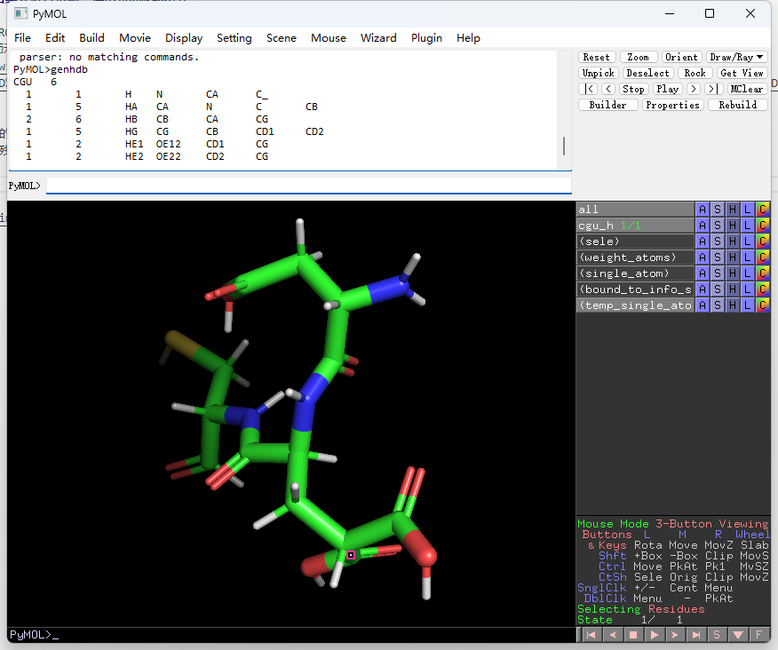

# genhdb
**未经测试，后续会进行更新，连alpha版都不算**

一个用于生成GROMACS hdb文件的未经测试的脚本 \
仅测试了李老师示例中的cgu_h.pdb并做了一定修改
https://jerkwin.github.io/2017/09/20/GROMACS%E9%9D%9E%E6%A0%87%E5%87%86%E6%AE%8B%E5%9F%BA%E6%95%99%E7%A8%8B2-%E8%8A%8B%E8%9E%BA%E6%AF%92%E7%B4%A0%E5%B0%8F%E8%82%BD%E5%AE%9E%E4%BE%8B/

## 用法
1. 非标准残基的resname需要和周围残基的resname不一样 \
2. 选中非标准残基作为sele
```
run /xxx/xxx/xxx/genhdb.py
```
